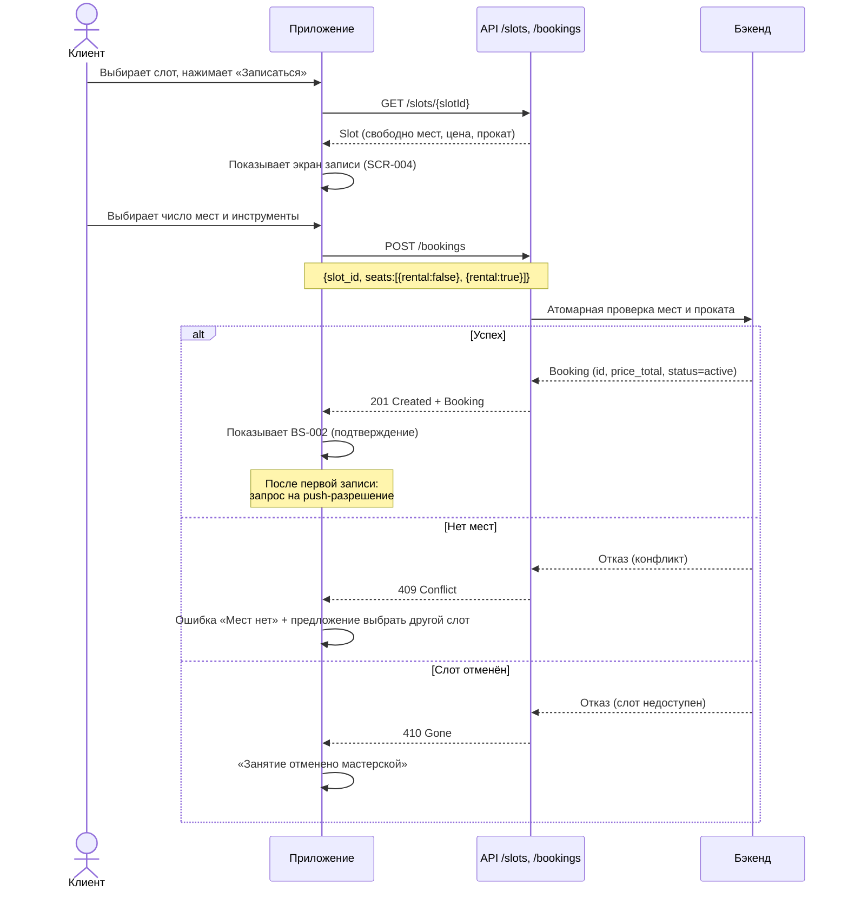
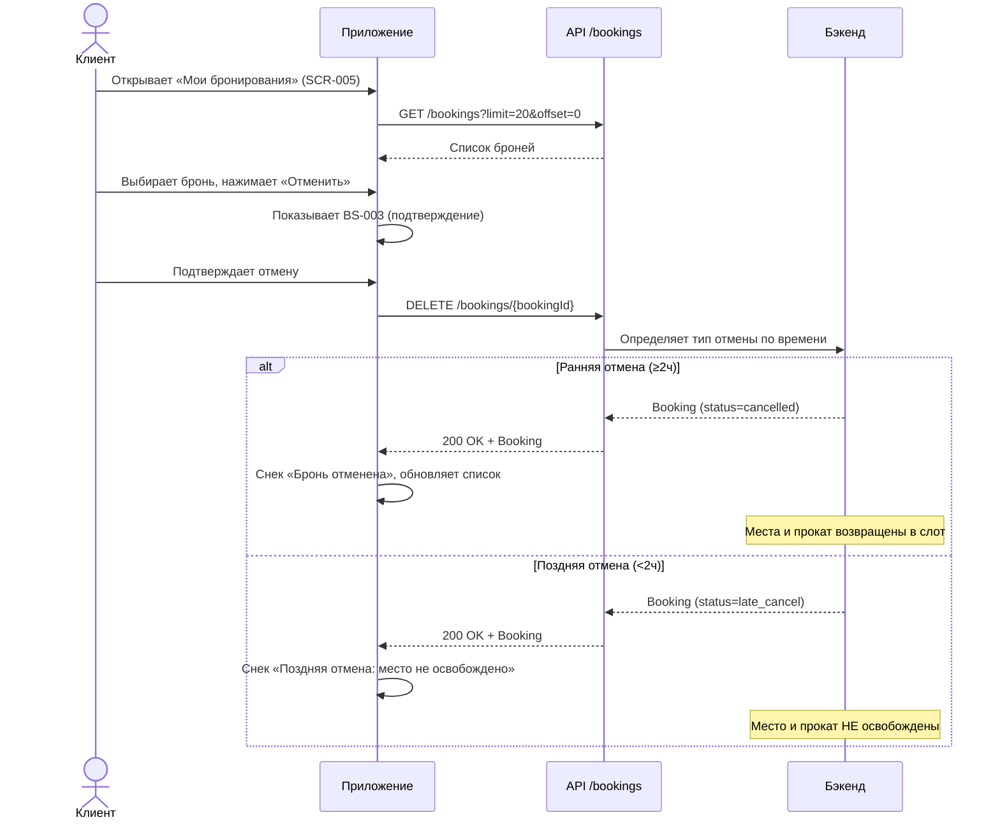
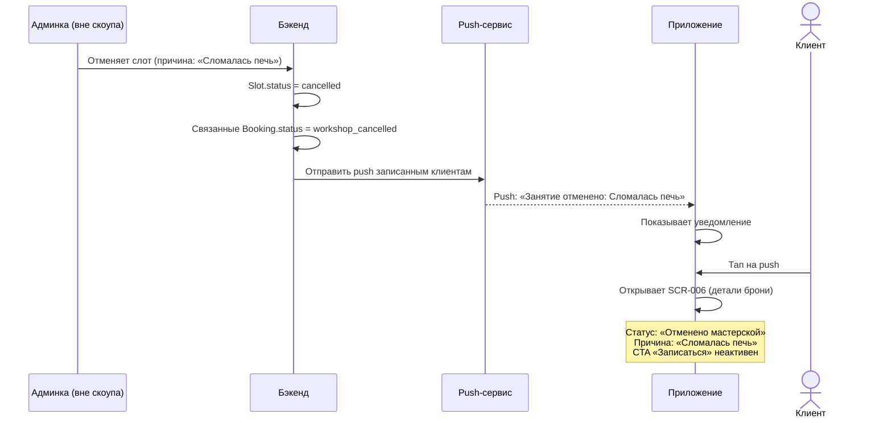
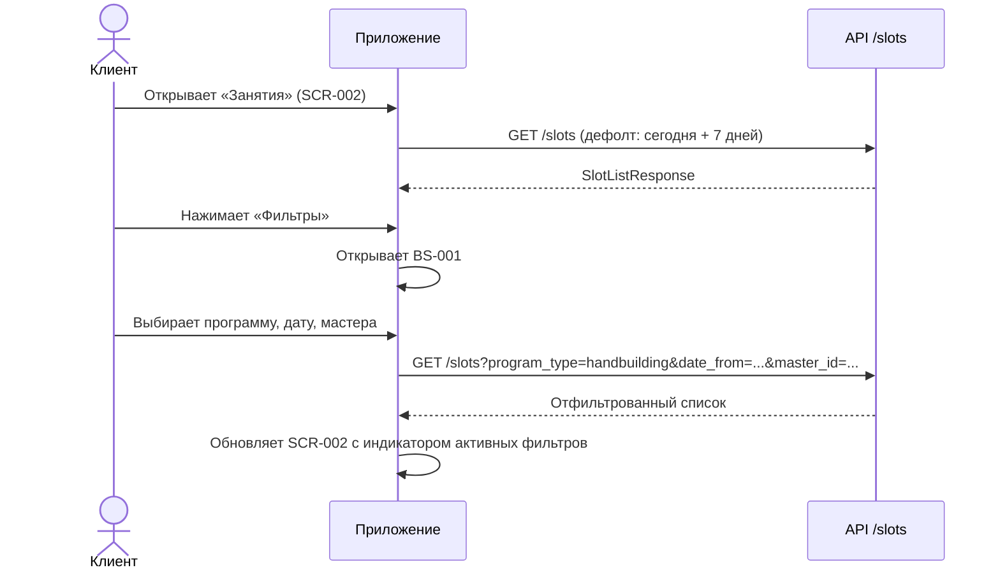

# Диаграммы последовательности API

> Этап 3. Ключевые сценарии взаимодействия клиентского приложения с API.

## UC-1. Запись на занятие



## UC-2. Отмена записи



## UC-3. Отмена слота мастерской → push клиенту



## UC-4. Фильтрация слотов



## UC-5. Вход / Регистрация (SMS OTP)

```mermaid
sequenceDiagram
    actor C as Клиент
    participant A as Приложение
    participant API as API /auth

    C->>A: Вводит имя и телефон
    A->>API: POST /auth/otp/send {phone:+7916...}
    API-->>A: 204 No Content (SMS отправлено)

    C->>A: Вводит 6-значный код
    A->>API: POST /auth/otp/verify {phone, code, name}
    alt Код верный
        API-->>A: 200 OK {tokens, user}
        A->>A: Сохраняет JWT
        A->>A: Переход на SCR-002 (Занятия)
    else Код неверный / истёк
        API-->>A: 401 Unauthorized
        A->>A: «Неверный или истёкший код»
    else Слишком часто
        API-->>A: 429 Too Many Requests
        A->>A: «Попробуйте через 60 секунд»
    end