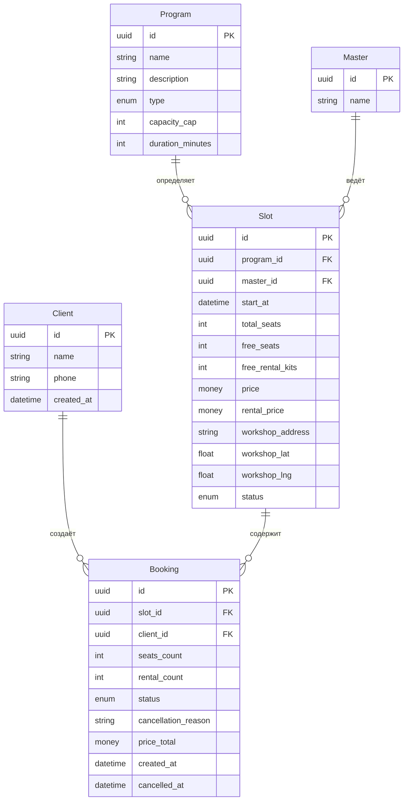
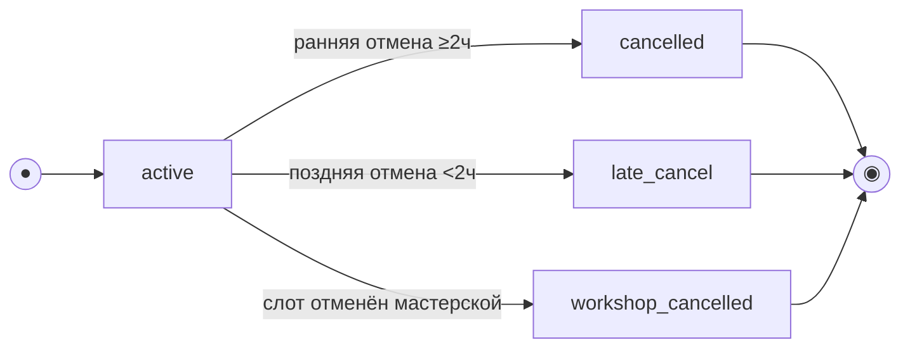
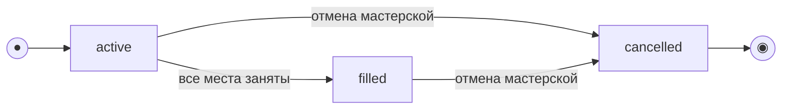

# Модель данных

> Этап 3. Проектирование. Описание сущностей, атрибутов и связей + ER-диаграмма.
>
> **Скоуп: клиентское приложение и API для него.** Это **ресурсная модель API** (что клиент
> читает/создаёт), а не схема БД. Хранение и бизнес-логика принадлежат **существующей инфраструктуре**.
>
> - **Program, Master, Slot** — read-only-проекция из существующего бэкенда.
> - **Client, Booking** — ресурсы клиентского API.
> - Сущности оценок/рейтингов в скоуп не входят (Phase 2).

## Сущности и атрибуты

### Client (Клиент)
| Атрибут | Тип | Описание |
| :-- | :-- | :-- |
| id | UUID (PK) | Идентификатор клиента |
| name | string | Имя |
| phone | string (unique) | Телефон — логин; вход по SMS OTP |
| created_at | datetime | Дата регистрации |

### Program (Программа) — справочник, read-only
| Атрибут | Тип | Описание |
| :-- | :-- | :-- |
| id | UUID (PK) | Идентификатор программы |
| name | string | Название |
| description | string? | Описание занятия |
| type | enum (`handbuilding`/`wheel`) | Лепка / Гончарный круг |
| capacity_cap | int | Потолок мест (лепка ≤6, круг ≤10) |
| duration_minutes | int | Продолжительность, мин |

### Master (Мастер) — справочник, read-only
| Атрибут | Тип | Описание |
| :-- | :-- | :-- |
| id | UUID (PK) | Идентификатор мастера |
| name | string | Имя |

### Slot (Слот / занятие) — read-only для клиента
| Атрибут | Тип | Описание |
| :-- | :-- | :-- |
| id | UUID (PK) | Идентификатор слота |
| program_id | FK → Program | Программа |
| master_id | FK → Master | Назначенный мастер |
| start_at | datetime (UTC) | Время начала (UTC) |
| total_seats | int | Всего мест |
| free_seats | int | Свободно мест |
| free_rental_kits | int | Свободных прокатных наборов |
| price | money (RUB) | Цена за место |
| rental_price | money (RUB) | Цена проката одного набора |
| workshop_address | string | Адрес мастерской |
| workshop_lat | float | Широта |
| workshop_lng | float | Долгота |
| status | enum (`active`/`filled`/`cancelled`) | Статус |

### Booking (Запись / бронь)
| Атрибут | Тип | Описание |
| :-- | :-- | :-- |
| id | UUID (PK) | Идентификатор |
| slot_id | FK → Slot | Слот |
| client_id | FK → Client | Кто записал |
| seats_count | int | Число мест (1–3) |
| rental_count | int | Сколько из мест — на прокате |
| status | enum (`active`/`cancelled`/`late_cancel`/`workshop_cancelled`) | Статус |
| cancellation_reason | string? | Причина отмены мастерской |
| price_total | money (RUB), read-only | Итоговая стоимость от сервера |
| created_at | datetime | Время создания |
| cancelled_at | datetime? | Время отмены |

---

## ER-диаграмма (Entity-Relationship Diagram)

---

## Модель состояний (жизненный цикл)

### Booking (Запись / бронь)

`status ∈ {active, cancelled, late_cancel, workshop_cancelled}`. Создаётся в `active`;
отмена — терминальный переход.

| Из | Событие | В | Эффект на слот |
| :-- | :-- | :-- | :-- |
| — | Подтверждение брони | `active` | `free_seats -= seats_count`; `free_rental_kits -= rental_count` |
| `active` | Отмена ≥ 2 ч | `cancelled` | Места и наборы **возвращаются** |
| `active` | Отмена < 2 ч | `late_cancel` | Место и набор **НЕ освобождаются** |
| `active` | Слот отменён мастерской | `workshop_cancelled` | Слот снят; push клиенту |

### Slot (Слот / занятие)

`status ∈ {active, filled, cancelled}` — read-only. Переход в `cancelled` вне скоупа.

---

## Ключевые инварианты

- `Slot.free_seats = total_seats − Σ(active+late_cancel bookings.seats_count)`
- `Slot.free_rental_kits = исходный фонд − Σ(active+late_cancel bookings.rental_count)`
- `Slot.total_seats ≤ Program.capacity_cap` (лепка ≤6, круг ≤10)
- Запись/отмена — атомарны; овербукинг исключён на стороне бэкенда