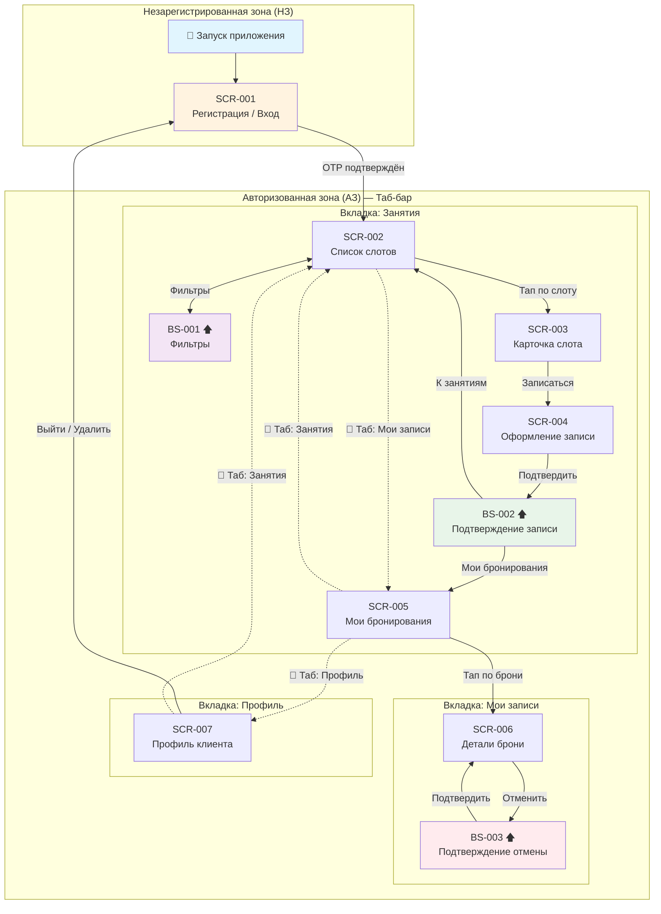

# Карта навигации проекта (Navigation Map)

> Граф переходов между экранами приложения «Глина». Аналог ER-диаграммы для UI-слоя.

## Визуальная схема

---

## Таблица переходов

| От | Action | К | Тип перехода | Условие |
|:--|:--|:--|:--|:--|
| Запуск | — | SCR-001 | Push | Нет авторизации |
| SCR-001 | OTP верный | SCR-002 | Replace | Первый вход / регистрация |
| SCR-002 | Тап «Фильтры» | BS-001 | Bottom Sheet | — |
| BS-001 | Применить / сбросить | SCR-002 | Dismiss + Update | Список обновляется |
| SCR-002 | Тап по карточке слота | SCR-003 | Push | — |
| SCR-003 | Тап «Записаться» | SCR-004 | Push | `free_seats > 0` |
| SCR-004 | Тап «Подтвердить запись» | BS-002 | Bottom Sheet | Успешный `POST /bookings` |
| BS-002 | Тап «Мои бронирования» | SCR-005 | Pop to Root + Tab Switch | — |
| BS-002 | Тап «К занятиям» | SCR-002 | Pop to Root | — |
| SCR-005 | Тап по брони | SCR-006 | Push | — |
| SCR-006 | Тап «Отменить» | BS-003 | Bottom Sheet | `start_at` в будущем |
| BS-003 | Тап «Да, отменить» | SCR-006 | Dismiss + Update | Обновлённый статус брони |
| SCR-007 | Тап «Выйти» | SCR-001 | Replace | Подтверждение → сброс сессии |
| SCR-007 | Тап «Удалить аккаунт» | SCR-001 | Replace | Подтверждение → удаление |

---

## Глубина навигации

| Сценарий | Путь | Глубина (экранов) |
|:--|:--|:--|
| Вход | SCR-001 → SCR-002 | 2 |
| Запись | SCR-002 → SCR-003 → SCR-004 → BS-002 | 4 (3 + шторка) |
| Отмена | SCR-005 → SCR-006 → BS-003 | 3 (2 + шторка) |
| Фильтрация | SCR-002 ↔ BS-001 | 1 + шторка |

> **Требование (P2):** От списка до подтверждения записи — **≤ 3 экранов**. Путь
> SCR-002 → SCR-003 → SCR-004 → BS-002 соответствует (2 перехода + финальная шторка).

---

## Состояния таб-бара

| Экран | Таб-бар виден? | Активная вкладка |
|:--|:--|:--|
| SCR-002 (Список слотов) | ✅ Да | Занятия |
| BS-001 (Фильтры) | ❌ Нет (шторка) | — |
| SCR-003 (Карточка слота) | ❌ Нет (вложенный) | — |
| SCR-004 (Оформление записи) | ❌ Нет (вложенный) | — |
| BS-002 (Подтверждение) | ❌ Нет (шторка) | — |
| SCR-005 (Мои бронирования) | ✅ Да | Мои записи |
| SCR-006 (Детали брони) | ❌ Нет (вложенный) | — |
| BS-003 (Подтверждение отмены) | ❌ Нет (шторка) | — |
| SCR-007 (Профиль) | ✅ Да | Профиль |