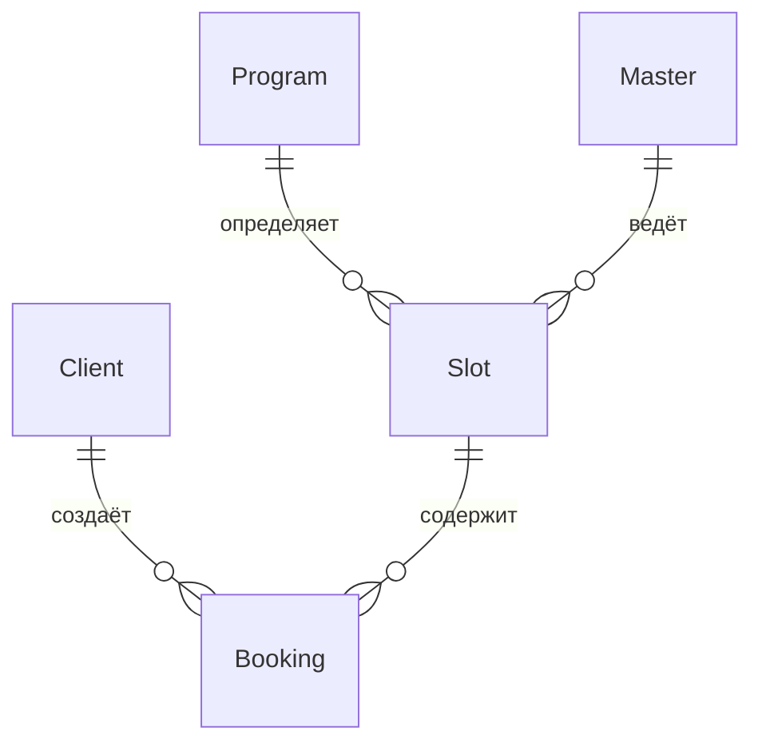
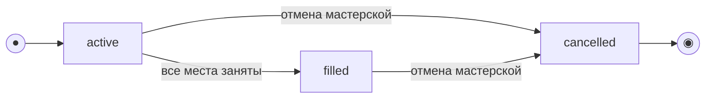
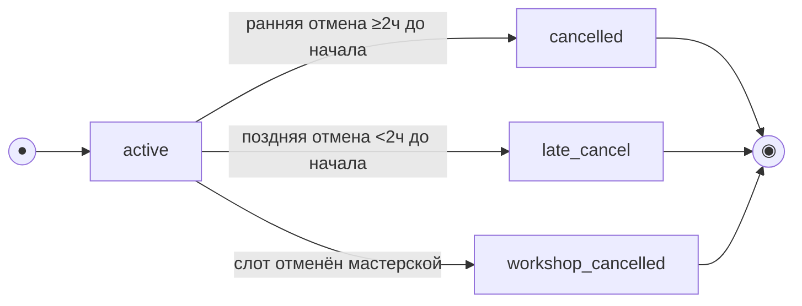

# Доменные сущности: Гончарная мастерская «Глина»
> Полная карта сущностей домена клиентского API

---

## 1. Обзор сущностей

> **Скоуп:** клиентское приложение и API. Сущности — **ресурсная модель API**, не схема БД.

| Сущность | Описание | Источник | Режим доступа |
|----------|----------|----------|---------------|
| **Client** | Клиент мастерской | API | Чтение/запись |
| **Program** | Программа занятия (справочник) | Бэкенд | Read-only |
| **Master** | Мастер (справочник) | Бэкенд | Read-only |
| **Slot** | Слот / занятие в расписании | Бэкенд | Read-only |
| **Booking** | Запись клиента на занятие | API | Создание/чтение/отмена |



---

## 2. Client (Клиент)

### Описание
Клиент мастерской — конечный пользователь приложения. Идентифицируется по номеру телефона, авторизация через SMS OTP.

### Атрибуты
| Поле | Тип | API | Описание |
|------|-----|-----|----------|
| `id` | UUID | GET /profile | Уникальный идентификатор |
| `name` | string | GET/PATCH /profile | Имя клиента |
| `phone` | string (unique) | GET /profile | Телефон в формате E.164 (+7...) — логин |
| `created_at` | datetime | — | Дата регистрации (системное) |

### Правила
- Телефон обязателен, уникален, формат E.164
- Имя указывается при первой верификации OTP
- При удалении аккаунта:
  - Активные брони аннулируются (места освобождаются)
  - Прошедшие брони анонимизируются (без привязки к персональным данным)

### Экраны
- SCR-001 (регистрация/вход)
- Профиль (SCR-005 → меню)

---

## 3. Program (Программа занятия)

### Описание
Справочник типов занятий. Read-only проекция из существующего бэкенда. Определяет тип, описание, продолжительность и максимальную вместимость.

### Атрибуты
| Поле | Тип | Описание |
|------|-----|----------|
| `id` | UUID (PK) | Идентификатор программы |
| `name` | string | Название (например, «Лепка для новичков») |
| `description` | string | Текстовое описание занятия |
| `type` | enum | `handbuilding` (лепка) / `wheel` (гончарный круг) |
| `capacity_cap` | int | Потолок мест: лепка ≤6, круг ≤10 |
| `duration_minutes` | int | Продолжительность занятия (минуты) |

### Бизнес-правила
- `capacity_cap` ограничивает максимальное число мест для слотов данной программы
- Тип программы используется в фильтре списка слотов (`program_type=handbuilding,wheel`)
- Программа не управляется клиентом — read-only справочник

### Value Object: ProgramBrief
Урезанное представление для списка слотов:
- `id`, `name`, `type`

---

## 4. Master (Мастер)

### Описание
Справочник мастеров мастерской. Read-only проекция из бэкенда. Каждый слот назначен на конкретного мастера.

### Атрибуты
| Поле | Тип | Описание |
|------|-----|----------|
| `id` | UUID (PK) | Идентификатор мастера |
| `name` | string | Имя мастера (например, «Анна С.») |

### Value Object: MasterBrief
Урезанное представление для списка слотов и карточки:
- `id`, `name`

---

## 5. Slot (Слот / занятие)

### Описание
Занятие в расписании. Read-only проекция из бэкенда. Содержит полную информацию о времени, программе, мастере, ценах, доступности мест и прокатных наборов.

### Атрибуты
| Поле | Тип | Описание |
|------|-----|----------|
| `id` | UUID (PK) | Идентификатор слота |
| `program` | Program / ProgramBrief | Программа занятия (вложенный объект) |
| `master` | Master / MasterBrief | Назначенный мастер (вложенный объект) |
| `start_at` | datetime (UTC) | Время начала занятия |
| `total_seats` | int | Общее число мест |
| `free_seats` | int | Свободных мест |
| `free_rental_kits` | int | Свободных прокатных наборов |
| `price` | decimal (RUB) | Цена за одно место |
| `rental_price` | decimal (RUB) | Цена проката одного набора |
| `price_total` | decimal (RUB) | **Итоговая стоимость** (сервер считает) |
| `workshop_address` | string | Адрес мастерской (текст) |
| `workshop_coordinates` | `{lat, lng}` | Координаты для карты |
| `status` | enum | `active` / `filled` / `cancelled` |

### Бизнес-правила
- **Дефолтный период:** слоты показываются на ближайшие 7 дней
- **Фильтрация:** по дате, типу программы, мастеру, «только свободные»
- **Отменённый слот** (`cancelled`): бронирование запрещено (HTTP 410), отображается в списке с пометкой
- **Заполненный слот** (`filled`): мест нет, кнопка записи неактивна
- Цена фиксируется на момент создания брони и не меняется

### Формула стоимости
```
price_total = price × seats_count + rental_price × rental_count
```

### Модель состояний


| Переход | Причина |
|---------|---------|
| `active` → `filled` | Все места забронированы |
| `active` → `cancelled` | Отмена мастерской (форс-мажор, ремонт) |
| `filled` → `cancelled` | Отмена мастерской даже при полной заполненности |

---

## 6. Booking (Бронирование / запись)

### Описание
Запись клиента на занятие. Создаётся через клиентский API, содержит выбранные места и инструменты.

### Атрибуты
| Поле | Тип | Описание |
|------|-----|----------|
| `id` | UUID (PK) | Идентификатор брони |
| `slot` | SlotListItem | Слот (вложенный объект) |
| `seats_count` | int | Общее число мест (1–3) |
| `rental_count` | int | Сколько из мест — на прокат |
| `price_total` | decimal (RUB) | Итоговая стоимость (сервер) |
| `status` | enum | `active` / `cancelled` / `late_cancel` / `workshop_cancelled` |
| `cancellation_reason` | string? | Причина отмены (для `workshop_cancelled`) |
| `created_at` | datetime (UTC) | Время создания брони |
| `cancelled_at` | datetime? | Время отмены |

### Бизнес-правила
- **Макс. мест:** 1–3 (себя + до 2 гостей)
- **Лимит:** `min(free_seats, program.capacity_cap, 3)`
- **Прокат** ограничен свободным фондом: `rental_count <= free_rental_kits`
- **Свои инструменты** не занимают прокатный фонд
- Отмена возможна **только целиком** (все места разом)
- Частичная отмена отдельного места/гостя — не поддерживается

### Модель состояний


| Из | Событие | В | Эффект на слот |
|----|---------|---|----------------|
| — | Подтверждение брони | `active` | `free_seats -= seats_count`, `free_rental_kits -= rental_count` |
| `active` | Отмена ≥ 2 ч | `cancelled` | Места и наборы **возвращаются** |
| `active` | Отмена < 2 ч | `late_cancel` | Места и наборы **НЕ освобождаются** |
| `active` | Отмена мастерской | `workshop_cancelled` | Слот снят; push клиенту |

### Статусы расшифровка
| Статус | Значение |
|--------|----------|
| `active` | Бронь действительна, занятие предстоит |
| `cancelled` | Отменена клиентом за ≥2 часов (места освобождены) |
| `late_cancel` | Поздняя отмена клиентом (<2 часов), места **не** освобождены |
| `workshop_cancelled` | Отменена мастерской (форс-мажор), push-уведомление |

---

## 7. Дополнительные Value Objects

### SeatRequest (DTO при создании брони)
| Поле | Тип | Описание |
|------|-----|----------|
| `rental` | boolean | `true` — прокатные инструменты; `false` — свои |

Используется в `BookingCreateRequest.seats[]` (1–3 элемента).

### TokenPair (DTO авторизации)
| Поле | Тип | Описание |
|------|-----|----------|
| `access_token` | string | JWT, срок 24 ч |
| `refresh_token` | string | JWT, срок 30 дней |
| `expires_in` | int | Время жизни access-токена (сек) |

---

## 8. Ключевые инварианты домена

```
1. Slot.free_seats = total_seats − Σ(active + late_cancel bookings.seats_count)

2. Slot.free_rental_kits = исходный_фонд − Σ(active + late_cancel bookings.rental_count)

3. Slot.total_seats ≤ Program.capacity_cap

4. Booking.seats_count ≤ min(Slot.free_seats, Program.capacity_cap, 3)

5. Booking.rental_count ≤ Slot.free_rental_kits

6. Booking.price_total = Slot.price × Booking.seats_count + Slot.rental_price × Booking.rental_count
   (сервер — источник истины, клиент отображает)

7. Запись/отмена — атомарны на стороне бэкенда (овербукинг исключён)
```

---

## 9. Агрегаты и границы консистентности

### Сущности агрегатов
| Агрегат | Корень | Дочерние сущности |
|---------|--------|-------------------|
| **Slot** | Slot | Booking (ссылки) |
| **Client** | Client | Booking (ссылки) |
| **Booking** | Booking | SeatRequest (value objects) |

### Граница транзакционности
- **Создание Booking** = атомарная операция на бэкенде
  - Проверка свободных мест
  - Проверка прокатного фонда
  - Фиксация цены
  - Возврат `price_total`
- **Отмена Booking** = атомарная операция
  - Определение типа отмены (ранняя/поздняя) на основе серверного времени
  - Освобождение/удержание ресурсов

---

## 10. Связи в API

| Ресурс | Связи | Примечание |
|--------|-------|-----------|
| `GET /slots` | ProgramBrief, MasterBrief | Вложенные объекты |
| `GET /slots/{id}` | Program (полный), MasterBrief, coordinates | Полная карточка |
| `GET /bookings` | SlotListItem | Бронь содержит слот |
| `GET /bookings/{id}` | SlotListItem | Детали брони |
| `POST /bookings` | slot_id, seats[] | SeatRequest — value object |
| `GET /profile` | UserProfile | Профиль клиента |

---

## 11. Источники

| Документ | Путь |
|----------|------|
| Модель данных (ERD) | `pottery-workshop/01-analysis/4-design/data-model.md` |
| Навигация | `pottery-workshop/01-analysis/4-design/navigation-map.md` |
| Функциональные требования | `pottery-workshop/01-analysis/2-requirements/functional-requirements.md` |
| Схема API (Slots) | `pottery-workshop/01-analysis/api/slots/models.yaml` |
| Схема API (Bookings) | `pottery-workshop/01-analysis/api/bookings/models.yaml` |
| Схема API (Auth) | `pottery-workshop/01-analysis/api/auth/models.yaml` |
| Схема API (Profile) | `pottery-workshop/01-analysis/api/profile/models.yaml` |

---

> **Версия:** 1.0.0  
> **Обновлено:** 2026-07-06