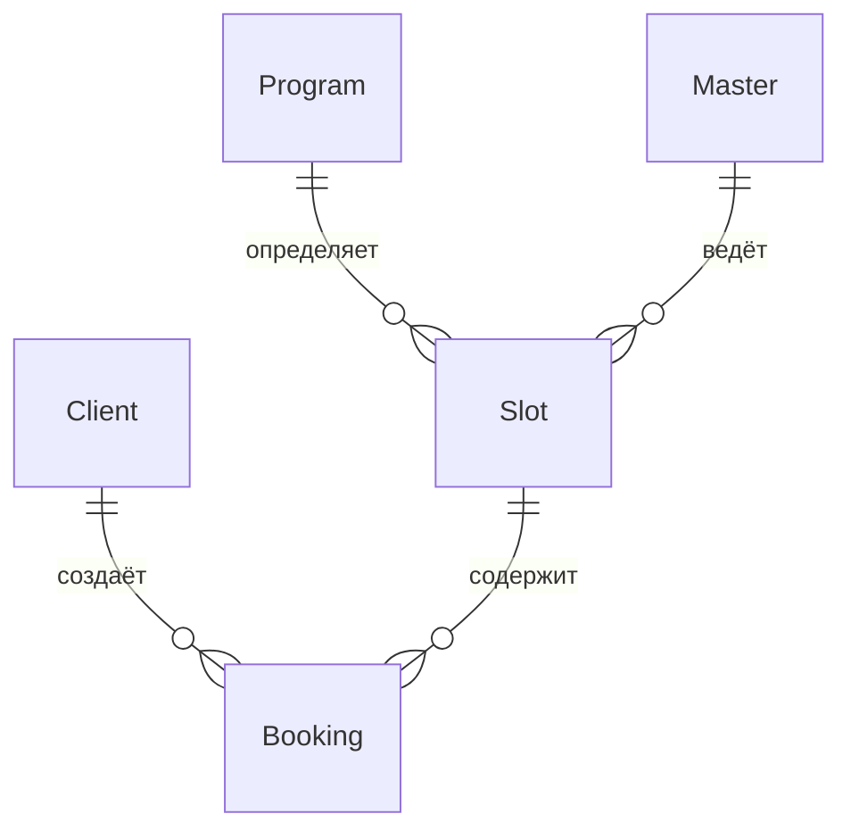

# Onboarding: Гончарная мастерская «Глина»
> Учебный проект — клиентское мобильное приложение для записи на мастер-классы

---

## 1. Общая информация о проекте

**Название:** Гончарная мастерская «Глина»  
**Заказчик:** Марина, владелица мастерской  
**Цель:** Заменить ручную запись в Instagram/DM и ежедневнике на автоматизированное клиентское приложение

### Что делаем
Клиентское мобильное приложение + API для записи клиентов на мастер-классы по гончарному искусству.

### Что НЕ делаем (вне скоупа)
- Интерфейсы мастера и администратора (уже существуют)
- Создание/редактирование расписания (CRUD слотов)
- Онлайн-оплата (Phase 2)
- Оценки мастеров (Phase 2)
- Программа лояльности (Phase 2)

---

## 2. Домен и бизнес-контекст

### Участники
| Роль | Описание |
|------|----------|
| **Клиент** | Записывается на занятия, управляет бронями — **наша целевая аудитория** |
| **Мастер** | Ведёт занятия (4 постоянных + помощники в сезон) — интерфейс существует |
| **Владелица/Админ** | Марина, управляет расписанием — интерфейс существует |

### Бизнес-процесс
1. Мастерская публикует расписание на неделю вперёд
2. Клиент видит слоты и записывается
3. Клиент выбирает: свои инструменты или прокат
4. Занятие проходит (2–2.5 часа)
5. При необходимости — отмена с политикой 2 часа

### Ограничения бизнеса
- **10 гончарных кругов** всего
- **≤6 человек** на новичковые группы (лпка)
- **≤10 человек** на круг (опытные)
- **Прокатных наборов** ограниченное количество (отдельный учёт)

---

## 3. Архитектура и технические решения

### Общая схема
```
┌─────────────────────┐       ┌──────────────────┐       ┌─────────────────┐
│  Клиентское         │◄─────►│  API (наш скоуп) │◄─────►│  Существующий   │
│  мобильное приложение│       │  OpenAPI 3.0.3   │       │  бэкенд (black- │
│  (роль: Клиент)     │       │                  │       │  box источник)  │
└─────────────────────┘       └──────────────────┘       └─────────────────┘
```

### Ключевые архитектурные решения
| Решение | Детали | ID |
|---------|--------|-----|
| **Авторизация** | SMS OTP (без паролей) | FR-43 |
| **Уведомления** | Системные push-уведомления | FR-33 |
| **Бэкенд** | Black-box источник истины | R-004 |
| **Время** | UTC в API, локальная TZ на клиенте | — |
| **Валюта** | RUB | — |

---

## 4. Функциональные модули (MVP)

### 4.1 Авторизация
- Регистрация по имени и телефону
- Вход по SMS OTP
- Refresh token
- Logout / удаление аккаунта

### 4.2 Просмотр слотов (расписание)
- Список слотов на 7 дней по умолчанию
- Карточка слота с деталями
- Фильтры: дата, тип программы, мастер, «только свободные»
- Отображение адреса с картой (Яндекс.Карты, fallback на текст)

### 4.3 Запись на занятие
- Выбор мест (1–3: себя + до 2 гостей)
- Выбор инструментов на каждое место (свои/прокат)
- Расчёт стоимости: `price_total = price × seats + rental_price × rental_count`
- Бронирование через API (атомарность на стороне бэкенда)

### 4.4 Мои бронирования
- История с пагинацией
- Статусы: активна, отменена клиентом (ранняя/поздняя), отменена мастерской
- Отмена брони (целиком, не частично)
- Политика отмены: **ранняя** ≥2 часов до начала (места освобождаются), **поздняя** <2 часов (статус late_cancel, места не освобождаются)

### 4.5 Профиль
- Просмотр/редактирование имени и телефона
- Удаление аккаунта (анонимизация истории)

---

## 5. API Endpoints

| Метод | Путь | Описание | Экран |
|-------|------|----------|-------|
| `POST` | `/auth/otp/send` | Запрос SMS OTP | SCR-001 |
| `POST` | `/auth/otp/verify` | Проверка OTP + вход/регистрация | SCR-001 |
| `POST` | `/auth/refresh` | Обновление access-токена | — |
| `GET` | `/slots` | Список слотов с фильтрами | SCR-002 |
| `GET` | `/slots/{slotId}` | Карточка слота | SCR-003 |
| `GET` | `/masters` | Справочник мастеров | SCR-002 (фильтр) |
| `GET` | `/bookings` | Мои бронирования | SCR-005 |
| `POST` | `/bookings` | Запись на занятие | SCR-004 |
| `GET` | `/bookings/{bookingId}` | Детали брони | SCR-006 |
| `DELETE` | `/bookings/{bookingId}` | Отмена брони | BS-003 |
| `GET` | `/profile` | Профиль клиента | SCR-005 (меню) |
| `PATCH` | `/profile` | Обновление профиля | — |
| `DELETE` | `/profile` | Удаление аккаунта | — |

---

## 6. Модель данных (кратко)

### Основные сущности


### Ключевые поля
| Сущность | Ключевые атрибуты |
|----------|-------------------|
| **Slot** | `id`, `start_at`, `end_at`, `program`, `master`, `total_seats`, `free_seats`, `free_rental_kits`, `price`, `rental_price`, `status` |
| **Booking** | `id`, `slot`, `seats_count`, `rental_count`, `price_total`, `status`, `created_at` |
| **Program** | `id`, `name`, `type` (лепка/круг), `description`, `capacity_cap` |
| **Master** | `id`, `name`, `bio`, `photo_url` |
| **Client** | `id`, `name`, `phone`, `created_at` |

---

## 7. Навигация и экраны

```
SCR-001 Регистрация/Вход
    └──► SCR-002 Список слотов
            ├──► SCR-003 Карточка слота
            │       └──► SCR-004 Оформление записи
            │               └──► BS-002 Подтверждение
            │                       └──► SCR-005 Мои бронирования
            └──► (фильтры, мастера)
    
SCR-005 Мои бронирования
    └──► SCR-006 Детали брони
            └──► BS-003 Отмена
```

### Экраны приложения
| ID | Экран | Описание |
|----|-------|----------|
| SCR-001 | Регистрация/Вход | Телефон → SMS OTP → имя (при регистрации) |
| SCR-002 | Список слотов | Лента занятий, фильтры, empty state |
| SCR-003 | Карточка слота | Детали, мастер, цена, карта, кнопка «Записаться» |
| SCR-004 | Оформление записи | Выбор мест и инструментов, итоговая стоимость |
| BS-002 | Подтверждение | Успешная запись, переход к бронированиям |
| SCR-005 | Мои бронирования | История, предстоящие/прошедшие, статусы |
| SCR-006 | Детали брони | Полная информация, кнопка отмены |
| BS-003 | Отмена | Подтверждение отмены, результат |

---

## 8. Критические бизнес-правила

### Запись (Booking)
- **Макс. мест на бронь:** `min(free_seats, program.capacity_cap, 3)`
- **Прокат:** `rental_count <= free_rental_kits`
- **Свои инструменты** не занимают прокатный фонд
- **Цена:** сервер считает, клиент отображает `price_total`
- **Атомарность:** 0 двойных броней — гарантия бэкенда

### Отмена
- **Ранняя:** ≥2 часов до начала → места освобождаются, бронь отменена
- **Поздняя:** <2 часов → статус `late_cancel`, места НЕ освобождаются, штрафов нет
- **Отмена мастерской:** бронь переходит в статус «Отменено мастерской», push-уведомление, повторная запись запрещена (HTTP 410)

### Отменённый слот
- Статус `cancelled` в списке
- Кнопка записи неактивна
- Повторная запись — HTTP 410

---

## 9. Структура репозитория

```
pottery-workshop/
├── README.md                          # Обзор проекта
├── 01-analysis/                       # Аналитическая документация
│   ├── 0-customer-brief/              # Исходный бриф от Марины
│   ├── 1-elicitation/                 # Уточняющие вопросы, домен
│   ├── 2-requirements/                # Требования
│   │   ├── business-requirements.md
│   │   ├── functional-requirements.md     # ← FR-NN (Must/Should/Could/Won't)
│   │   ├── non-functional-requirements.md # ← NFR (производительность, безопасность)
│   │   ├── use-cases.md
│   │   └── user-stories.md
│   ├── 3-design-brief/                # Дизайн-бриф и foundations
│   ├── 4-design/                      # ERD, sequence diagrams, навигация
│   │   ├── data-model.md
│   │   └── navigation-map.md
│   ├── 5-mobile-app-spec/             # Фича-лист с приоритетами
│   ├── checklists/                    # Чеклисты качества документации
│   ├── prompts/                       # Примеры промптов для ИИ
│   └── api/                           # OpenAPI 3.0.3 спецификация
│       ├── package.json
│       ├── auth/                      # Авторизация (OTP, refresh)
│       ├── slots/                     # Слоты (read-only)
│       ├── bookings/                  # Бронирования (CRD)
│       ├── masters/                   # Справочник мастеров
│       ├── profile/                   # Профиль клиента
│       └── common/                    # Общие модели, параметры, ошибки
├── 02-development/                    # Код проекта (пусто — для разработки)
```

---

## 10. Ключевые требования и ограничения

### Must HAVE (критично для запуска)
- [x] Регистрация и вход по SMS OTP
- [x] Просмотр слотов на 7 дней с фильтрами
- [x] Запись на занятие (1–3 места, выбор инструментов)
- [x] История бронирований
- [x] Отмена с политикой 2 часа
- [x] Push-уведомления (напоминания, отмена мастерской)
- [x] Профиль и удаление аккаунта

### Phase 2 (после запуска)
- [ ] Оценки мастеров
- [ ] Онлайн-оплата
- [ ] «Поделиться» занятием

### Won't (MVP)
- Программа лояльности
- Интерфейсы мастера/админа
- CRUD расписания

---

## 11. Полезные ссылки

| Ресурс | Путь |
|--------|------|
| Исходный бриф | `brief-pottery.md` (корень) |
| Обзор проекта | `pottery-workshop/README.md` |
| Функциональные требования | `pottery-workshop/01-analysis/2-requirements/functional-requirements.md` |
| Нефункциональные требования | `pottery-workshop/01-analysis/2-requirements/non-functional-requirements.md` |
| Use Cases | `pottery-workshop/01-analysis/2-requirements/use-cases.md` |
| User Stories | `pottery-workshop/01-analysis/2-requirements/user-stories.md` |
| Модель данных | `pottery-workshop/01-analysis/4-design/data-model.md` |
| Карта навигации | `pottery-workshop/01-analysis/4-design/navigation-map.md` |
| API (Slots) | `pottery-workshop/01-analysis/api/slots/api.yaml` |
| API (Bookings) | `pottery-workshop/01-analysis/api/bookings/api.yaml` |
| API (Auth) | `pottery-workshop/01-analysis/api/auth/api.yaml` |
| API (Masters) | `pottery-workshop/01-analysis/api/masters/api.yaml` |
| API (Profile) | `pottery-workshop/01-analysis/api/profile/api.yaml` |
| Общие модели | `pottery-workshop/01-analysis/api/common/models.yaml` |

---

## 12. С чего начать разработку

### Этап 1: Инфраструктура
1. Настроить проект мобильного приложения
2. Настроить HTTP-client с Bearer-авторизацией
3. Реализовать хранение токенов (secure storage)
4. Настроить push-уведомления

### Этап 2: Авторизация
1. Экран ввода телефона
2. Экран ввода OTP
3. Логика отправки/верификации
4. Обработка refresh-token

### Этап 3: Основной функционал
1. Список слотов (SCR-002) + фильтры
2. Карточка слота (SCR-003)
3. Оформление записи (SCR-004)
4. Мои бронирования (SCR-005)
5. Детали и отмена (SCR-006, BS-003)

### Этап 4: Профиль и полировка
1. Профиль клиента
2. Удаление аккаунта
3. Обработка edge cases (offline, empty states, ошибки API)

---

## 13. Частые вопросы (FAQ)

**Q: Может ли клиент записаться на прошедший слот?**  
A: Нет. API возвращает только предстоящие слоты.

**Q: Что если слот заполнился, пока клиент оформлял запись?**  
A: Бэкенд атомарно проверяет места. При отсутствии — ошибка, клиент видит «Мест нет».

**Q: Как обрабатывать offline?**  
A: См. NFR. Базовый offline — кэширование списка слотов, при записи — проверка связи.

**Q: Почему нет онлайн-оплаты?**  
A: Заказчица принимает наличные/перевод. Онлайн-оплата — Phase 2.

**Q: Что делать с отменёнными слотами?**  
A: Показывать в списке с пометкой, кнопка записи неактивна. Повторная запись — 410.

---

## 14. Контакты и процессы

- **Заказчик:** Марина (владелица мастерской)
- **Срок:** К началу осеннего сезона (~2 месяца)
- **Приоритет:** Must-have функции первыми, Phase 2 — после запуска
- **Согласования:** Заказчица на связи для уточнений

---

> **Документ создан:** 2026-07-06  
> **Последнее обновление спецификации:** 2026-07-01 (согласование Phase 2)  
> **Версия API:** 1.0.0